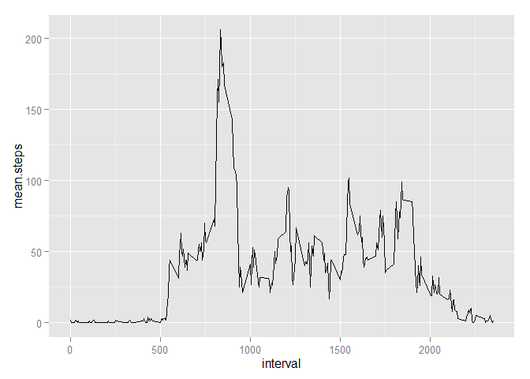
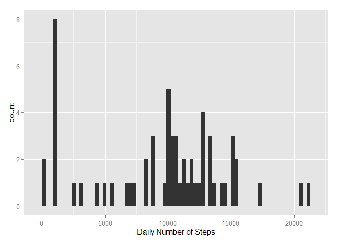
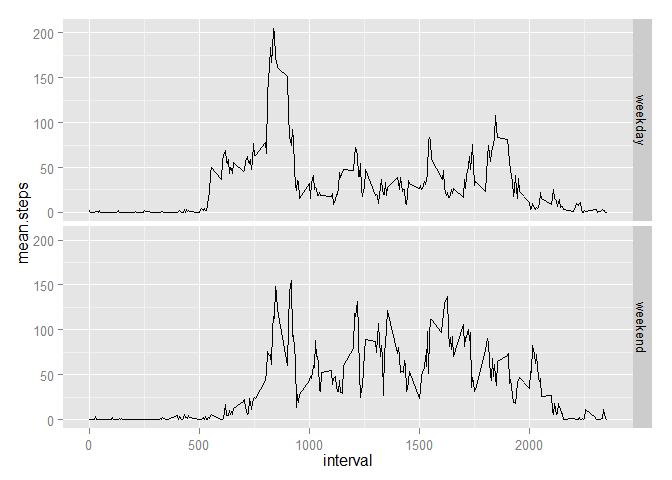

# Reproducible Data - Assignment 1 - Activity Tracker
Stephen Dragoni  
Wednesday, April 15, 2015  
# Assignment

It is now possible to collect a large amount of data about personal movement using activity monitoring devices such as a Fitbit, Nike Fuelband, or Jawbone Up. These type of devices are part of the “quantified self” movement – a group of enthusiasts who take measurements about themselves regularly to improve their health, to find patterns in their behavior, or because they are tech geeks. But these data remain under-utilized both because the raw data are hard to obtain and there is a lack of statistical methods and software for processing and interpreting the data.

This assignment makes use of data from a personal activity monitoring device. This device collects data at 5 minute intervals through out the day. The data consists of two months of data from an anonymous individual collected during the months of October and November, 2012 and include the number of steps taken in 5 minute intervals each day.

## Data

The data for this assignment can be downloaded from the course web site:

Dataset: Activity monitoring data [52K]
The variables included in this dataset are:

steps: Number of steps taking in a 5-minute interval (missing values are coded as NA)

date: The date on which the measurement was taken in YYYY-MM-DD format

interval: Identifier for the 5-minute interval in which measurement was taken

The dataset is stored in a comma-separated-value (CSV) file and there are a total of 17,568 observations in this dataset.


## Loading and preprocessing the data

Load the data (i.e. read.csv())

Process the data into a format suitable for analysis
 


```r
library(plyr)
library(ggplot2)


activity <- read.csv("activity.csv") # read in the data
activity$date <- as.POSIXct(activity$date) # set the dates to POSIXct
```

## What is mean total number of steps taken per day?

For this part of the assignment, we can ignore the missing values in the dataset.

Calculate the total number of steps taken per day

Make a histogram of the total number of steps taken each day


Calculate and report the mean and median of the total number of steps taken per day


```r
#Calculate the total number of steps taken per day
dailysteps <- aggregate(activity$steps, by = list(activity$date), sum, na.rm=TRUE) 
names(dailysteps) <- c("Date", "steps")

#Make a histogram of the total number of steps taken each day
qplot(steps, data = dailysteps, geom="histogram", xlab = "Daily Number of Steps")
```

```
## stat_bin: binwidth defaulted to range/30. Use 'binwidth = x' to adjust this.
```

 

```r
#Calculate and report the mean and median of the total number of steps taken per day
mean.steps <- mean(dailysteps$steps) 
median.steps <- median(dailysteps$steps)
```

The mean number of steps each day is 9354  
The median number of steps each day is 10395  

#What is the average daily activity pattern?

Make a time series plot of the 5-minute interval (x-axis) and the average number of steps taken, averaged across all days (y-axis)

Which 5-minute interval, on average across all the days in the dataset, contains the maximum number of steps?


```r
#df of the mean and median number of steps taken, averaged across all days (y-axis)
intsteps <- aggregate(activity$steps, by = list(activity$interval), mean, na.rm=TRUE)
intstepsmed <- aggregate(activity$steps, by = list(activity$interval), median, na.rm=TRUE)

intsteps <- cbind(intsteps[], intstepsmed$x)

#Tidy the df names and round the numbers
names(intsteps) = c("interval","mean.steps", "median.steps")
intsteps$mean.steps <- round(intsteps$mean.steps)
intsteps$median.steps <- round(intsteps$median.steps)


ggplot(intsteps, aes(x = interval, y = mean.steps)) + geom_line()
```

 

```r
most.steps <- intsteps$interval[intsteps$mean.steps == max(intsteps$mean.steps)]
```
The interval with the most steps each day (on average is) : 835
 
#Imputing missing values

There are a number of days/intervals where there are missing values (coded as NA). The presence of missing days may introduce bias into some calculations or summaries of the data.

Calculate and report the total number of missing values in the dataset (i.e. the total number of rows with NAs)

Replace the missing values with the median value for that interval. 

Create a new dataset that is equal to the original dataset but with the missing data filled in.

Make a histogram of the total number of steps taken each day and Calculate and report the mean and median total number of steps taken per day. 


```r
#find the NAs
na.steps <- subset(activity, is.na(steps))
num.NAs <-length(na.steps$steps)


#replace the NAs with the median number of steps for that period
nstps <- data.frame(date=activity$date[is.na(activity$steps)], interval = activity$interval[is.na(activity$steps)], steps=intsteps[match(intsteps$interval, activity$interval[is.na(activity$steps)]),3])

# remove the NA's from the period
activity <- subset(activity, !is.na(steps))

# Append the median steps to the Activity DF
activity <- rbind(activity, nstps)

#sum the number of steps each day into the dailysteps2 DF and get the mean and median 
dailysteps2 <- aggregate(activity$steps, by = list(activity$date), sum, na.rm=TRUE)
names(dailysteps2) <- c("Date", "steps")

qplot(steps, data = dailysteps2, geom="histogram", xlab = "Daily Number of Steps")
```

```
## stat_bin: binwidth defaulted to range/30. Use 'binwidth = x' to adjust this.
```

 

```r
mean.steps2 <- mean(dailysteps2$steps) # 
median.steps2 <- median(dailysteps2$steps)
```

There are 2304 intervals with NA

THe new mean number of steps is 9504 this is close to the mean from the data with NAs of 9354.  THe new median number of steps is 10395 this is the same as the median from the data with NAs of 10395. There is little impact to the estimated number of steps a day from using the median for the time interval.  I had previously used the mean but this introduced a sizeable difference.

#Are there differences in activity patterns between weekdays and weekends?

Create a new factor variable in the dataset with two levels – “weekday” and “weekend” indicating whether a given date is a weekday or weekend day.

Make a panel plot containing a time series plot (i.e. type = "l") of the 5-minute interval (x-axis) and the average number of steps taken, averaged across all weekday days or weekend days (y-axis). 


```r
# Add the Weekday/weekend identifier

activity$week <- ifelse(weekdays(activity$date) == "Saturday" | weekdays(activity$date) == "Sunday" ,"weekend","weekday")

#df of the mean and median number of steps taken, averaged across all days (y-axis)
intsteps2 <- aggregate(activity$steps, by = list(activity$week, activity$interval), mean, na.rm=TRUE)
intstepsmed2 <- aggregate(activity$steps, by = list(activity$week, activity$interval), median, na.rm=TRUE)

intsteps2 <- cbind(intsteps2[], intstepsmed2$x)

#Tidy the df names and round the numbers
names(intsteps2) = c("weekday", "interval","mean.steps", "median.steps")
intsteps2$mean.steps <- round(intsteps2$mean.steps)
intsteps2$median.steps <- round(intsteps2$median.steps)


ggplot(intsteps2, aes(x = interval, y = mean.steps))  + geom_line() + facet_grid(weekday~.)
```

 


